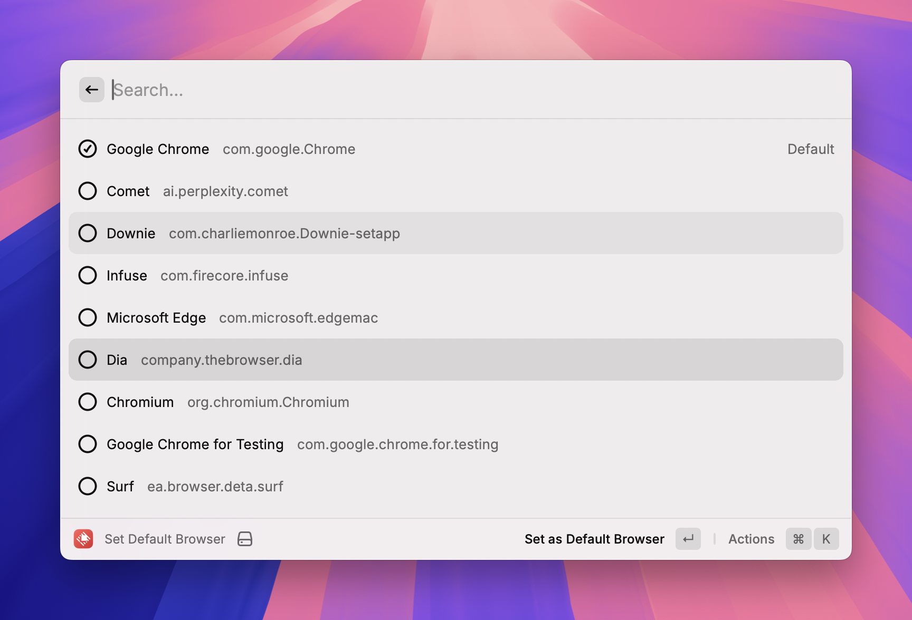

# Change Default Browser

A Raycast extension to quickly switch the default web browser on macOS.

{width=480}

## Features

- 🚀 List all installed web browsers on your Mac
- ✅ Show which browser is currently set as default
- 🔄 Switch default browser with one click
- 🔧 Zero external dependencies (only requires Xcode Command Line Tools)

## How it works

This extension uses a Swift script that calls macOS Launch Services API (`LSSetDefaultHandlerForURLScheme`) to modify the default browser for http/https protocols.

## Requirements

- macOS
- Xcode Command Line Tools (install with: `xcode-select --install`)

## Supported Browsers

- Safari
- Google Chrome
- Firefox
- Microsoft Edge
- Brave Browser
- Arc
- And any other browser that registers itself as an http/https handler

## Usage

1. Open Raycast
2. Search for "Set Default Browser"
3. Select your preferred browser from the list
4. Press Enter to set it as default

## Technical Details

The extension consists of:
- A Swift script (`assets/defbrowser.swift`) that handles system-level browser switching
- A TypeScript/React component that provides the UI and calls the Swift script

No Homebrew or third-party CLI tools required!

## License

MIT License - see [LICENSE](LICENSE) file for details.

Copyright (c) 2025 Kai Chen (kai@thekaiway.com)